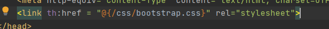

#MyAppDemo

##Lien Github du projet : 

https://github.com/fatimazahra-azennag/DM-POO.git
 - 1.Description des dépendances:

   -Starter of Spring web utilise Spring MVC, REST et 
   Tomcat comme serveur intégré par défaut.
   
   -Starter of Spring data JPA permet de gérer la persistance des
   données avec la base de données

   -Starter of Spring H2 Database  afin d'utiliser H2 comme une base de données (In memory Database), celui-ci signifit que nous n'avons pas besoin d'installer la base de données H2, elle sera automatiquent 
   créée et stockée dans la mémoire de l'ordinateur.

   -Starter of Spring thymleaf pour creer un template engine
   qui génére des templates qui respectent le format du document.
   Si vous écrivez un template pour une page HTML, le template sera une page HTML valide.

   -Starter of Spring devtools l'objectif de ce module est d'essayer d'améliorer l'expérience de temps de développement 
   lorsque vous travaillez sur les applications Spring Boot.

  -Starter of Spring Hibernate pour définir une implémentation du JPA afin 
  ge gérer la persistence des données.
   
   
   
  - Etape 13:
    
   1-on a paramétré l’url d’appel /greeting dans la partie du controller
   (la classe HelloWorldController @GetMapping="\greeting")
   
   2-Nous avons choisi le fichier HTML `a afficher avec 'return "greeting" '

   3-On a envoyé le nom `a qui nous disons bonjour avec le second lien
    à l'aide du paramètre nameGET passé dans l'annotation
    @RequestParam

 - Etape 17 
    
    Une table Adress s'est crée dans la base de donnée
   
  - Etape 18:
   
hibernate requète la base H2 pour créer les entitées définit à son niveau

  - Etape 20

  - Etape 23

L’annotation @Autowired permet d’activer l’injection automatique de dépendance

  - Etape 30
  
  1- Téléchargez Bootstrap sous forme de fichier Zip
  
  2-Décompresser le fichier zip sous le répertoire ressources/static du projet

  3- ajouter la ligne suivante au fichier navbar.html

  4-Le navbar avec Boostrap

T4:

Etape 7
1-Pour appeler MeteoConcept une clé API appelé communément "token" est nécessaire sinon
on obtiendra ce message en essayant d'accéeder à l'API avant 
d'avoir la clé

2-L'url de base est: https://api.meteo-concept.com/api/ 
en lui ajoutant les routes dépendant de notre besoin 
exemple de d'un url pour une route localisation https://api.meteo-concept.com/api/location/city

3-On utilise la méthode HTTP :GET

4-Les paramètres d'appels sont ajoutés à l'url en respectant 
le syntaxe suivant:
La chaîne de requête est introduite par un « ? » (point d’interrogation).
Chaque paramètre est nommé, il se compose donc d’un nom et d’une valeur : « Nom=Valeur ».
Si plusieurs paramètres doivent être inclus, ils sont reliés par un « & ».
et le premier paramètres à passer dans l'url c'est le token d'authentification

5-